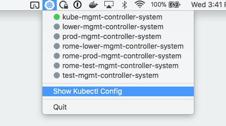
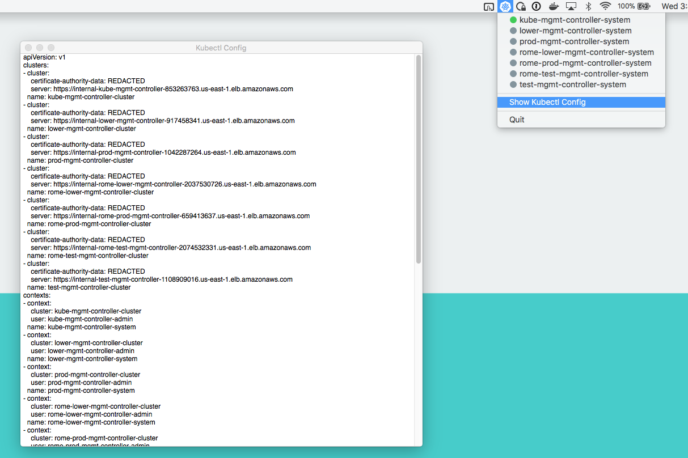

# Kontext

Kontext is macOS menubar app for managing kubernetes contexts. It reads all the different contexts in your kubectl config file and you can then easily switch between them. 

You can also view your Kubectl config file. 

## known issues. 

Currently the app only looks for `kubectl` in `/usr/local/bin`